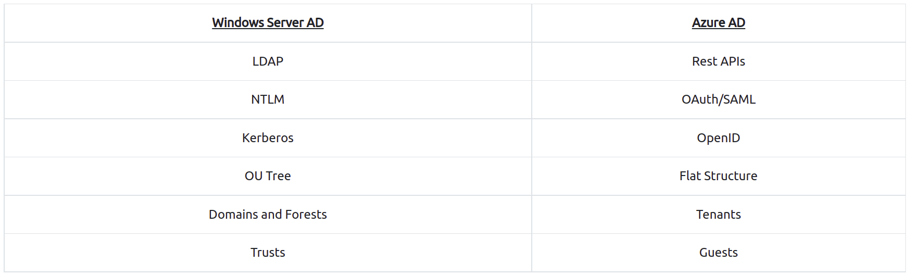
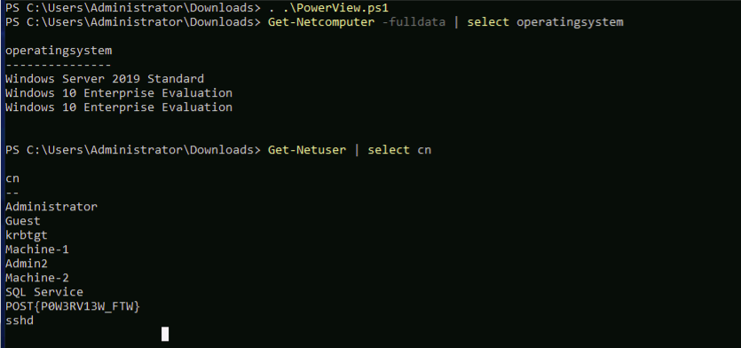

# Windows Basics

### **Permissions**

Permissions can be applied to,

* Users
* Groups

Permissions that can be set are,

* Full control
* Modify
* Read & execute
* List folders content
* Read  
* Write
* Special permissions

Tools to Check permission : `icacls`

Important letters

* I - permission inherited from the parent container
* F - full access \(full control\)
* M - Modify right/access  
* OI - object inherit
* IO - inherit only  
* CI - container inherit
* RX - read and execute  
* AD - append data \(add subdirectories\)  
* WD - write data and add files

###  **Active Directory**

* On-Premise Active Directory \(AD\)
* Azure Active Directory \(AAD\)

  Authentication on On-premise Active Directory

* NTLM 
  * LDAP / LDAPS
  * KERBEROS

Authentication on Azure Active Directory

* SAML \(Security Assertion Markup Language\)
* OAUTH 2.0
* OpenID Connect

**Built-in utility tools**

* Computer Management
* Local Security Policy
* Disk Cleanup
* Registry Editor
* Command-line tools
* Registry Editor \(Regedit\)

### **Windows Server AD vs Azure AD**



### **PowerView Tool** Tool is used to enumerate AD.

```text
powershell -ep bypass

. .\PowerView.ps1
```

Some example commands: 



Cheatsheet : [https://gist.github.com/HarmJ0y/184f9822b195c52dd50c379ed3117993](https://gist.github.com/HarmJ0y/184f9822b195c52dd50c379ed3117993)

